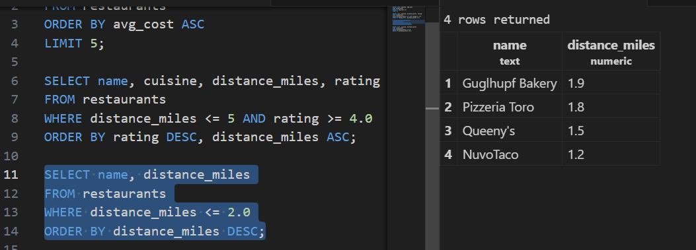
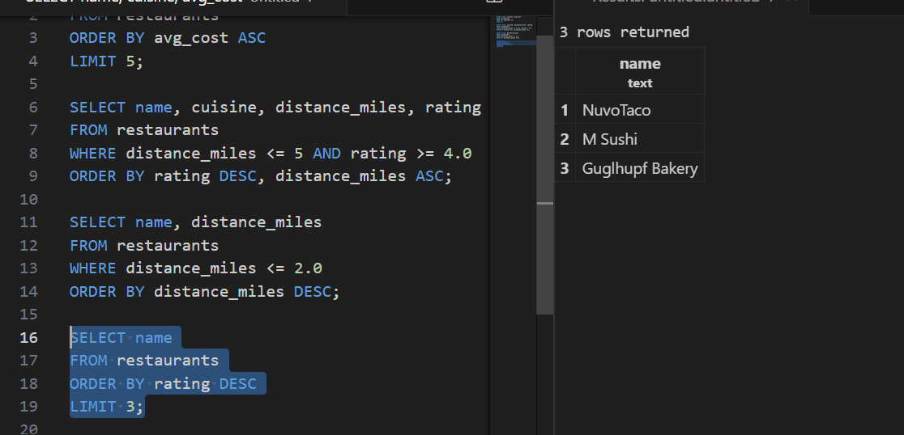
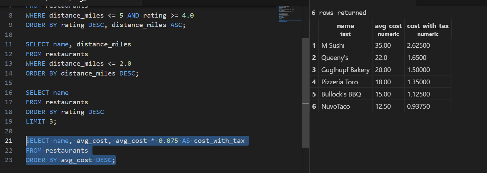
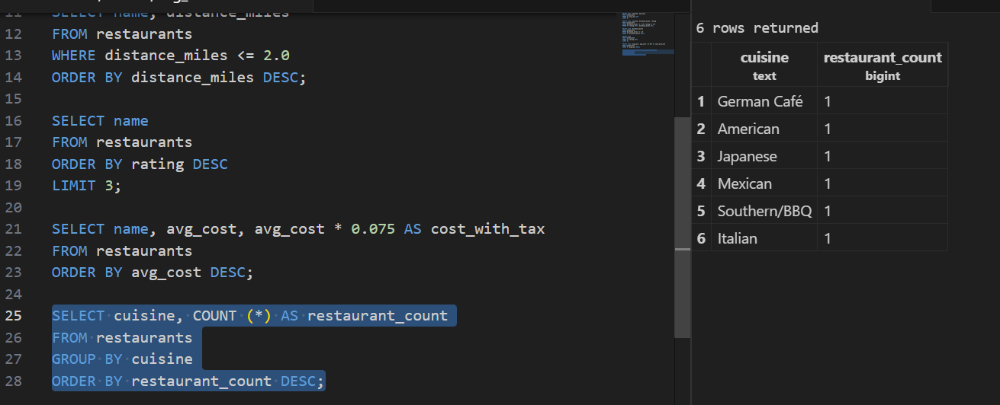

# ids706-postgres-demo
PostgreSQL Dev Container Tutorial

## Screenshots

A. Return name, distance_miles for restaurants within 2.0 miles, ordered by distance.

Ans: 

B. Show the top 3 restaurants by rating (highest first).

Ans: 

C. List name, avg_cost and cost with 7.5% tax as cost_with_tax.

Ans: 

D. How many restaurants are there per cuisine, highest count first?

Ans: 